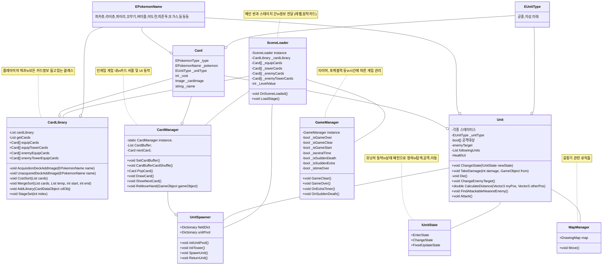

# 로딩중 유니티 2D 프로젝트

## 이 버전은 리소스파일이 포함되어 있지 않아 구동되지 않습니다.
loading_clash_royale의 리소스와 이미지 파일을 제거한 버전입니다.
해당 프로젝트의 리소스파일을 요청하시는 분이라면 제가 입사지원한 회사라고 생각합니다.
구현 환경을 보고 싶으신 분은 wlghksdl159@naver.com을 통해 요청바랍니다.

## 자세한 사항은 노션에서~
* https://www.notion.so/dduckchul/170c2881272780459a5ff2df888928c3?v=170c288127278143b23a000c46d1f8c7

## 프로젝트 초기 세팅
1. 깃 템플릿 추가 (커밋 메시지 샘플 등록)
> git config --local commit.template /.gitsettings/.gitmessage.txt
2. 깃훅 추가 (커밋 메시지 맞추기)
> git config core.hooksPath .gitsettings
3. 개행문자 수정 (https://dsaint31.tistory.com/209)
> ## windows
> git config --global core.autocrlf true
> ## mac
> git config --global core.autocrlf input

## 컨벤셔널 커밋
- https://www.conventionalcommits.org/ko/v1.0.0/

### 커밋 메시지 예시
feat: 캐릭터 기능 업데이트

1. 포켓몬 업데이트 했습니다~
2. 전투상태 업데이트

## 푸시 잘 되는지 테스트~
* https://discord.gg/wSkfuzBt 채팅방으로 웹훅 푸시함

## 클래스 다이어그램

